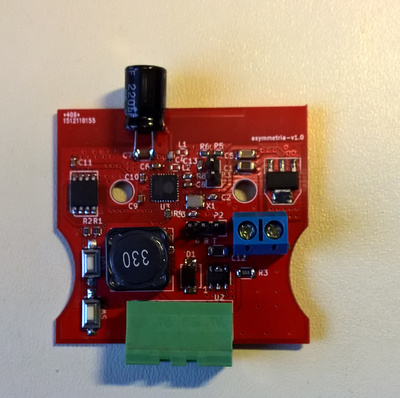

ESP8266-based LED dimmer designed to fit inside
a Lival Asymmetria desk lamp. The plan is to use [LED strips like
these](http://www.aliexpress.com/item/Ultra-thin-5W-LED-COB-60-Chip-Led-Driving-DRL-Daytime-Running-Light-Lamp-Bar-Strip/32303226004.html)
to replace the stock fluorescent lamp.

